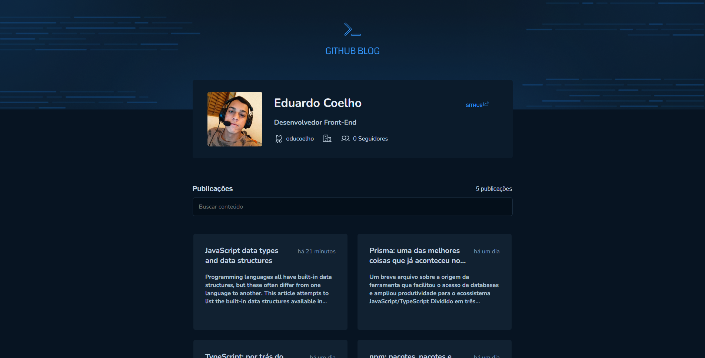
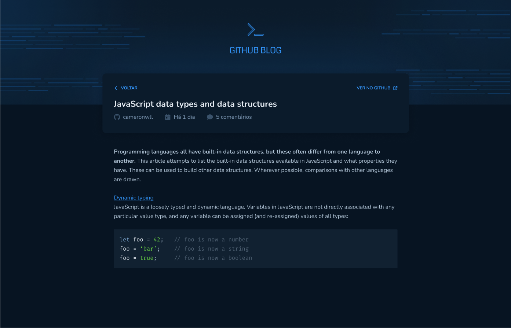

<h1 align="center">GitHub Blog</h1>

<h2>Home</h2>

<h2>Issues Details</h2>

## :memo: Descrição
* Um Blog do GitHub
## :books: Funcionalidades
* Nessa projeto, desenvolvi uma aplicação que utiliza a API do GitHub para buscar issues de um repositório, dados do perfil e exibir elas como um blog.

## :wrench: Tecnologias utilizadas
* TypeScript
* ReactJs
* Phosphoricons
* Styled Components
* React Router Dom
* React Hook Form
* useContext
* validações com o zod
* Axios
* API do Github
     
## :rocket: Rodando o projeto
Realize o download dos arquivos e execute o comando "npm i" para baixar a node modules dos projetos

## :handshake: Colaboradores
<table>
  <tr>
    <td align="center">
      <a href="http://github.com/oducoelho">
         
        
          <b>oducoelho</b>
        
      </a>
    </td>
  </tr>
</table>
